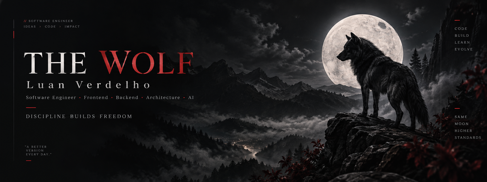
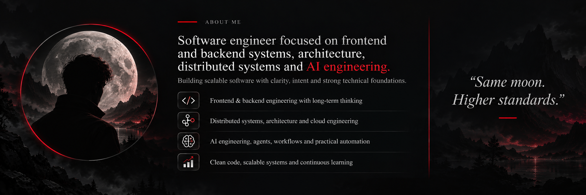
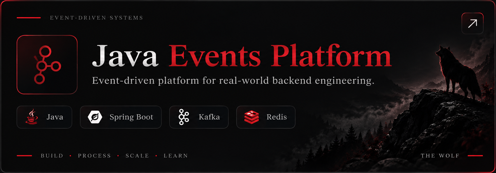
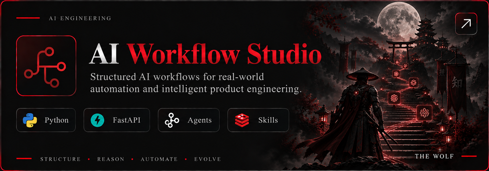
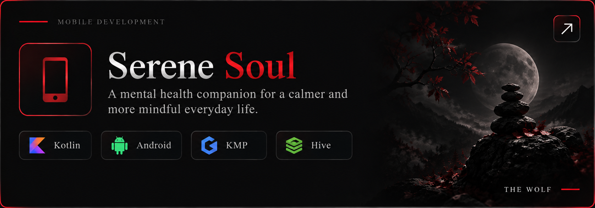
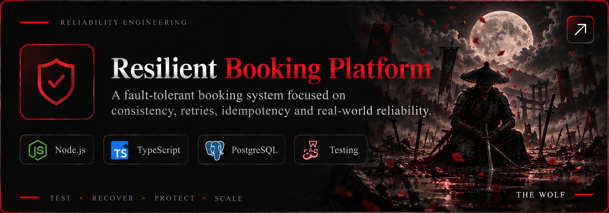
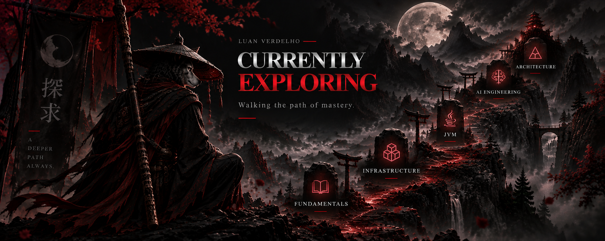
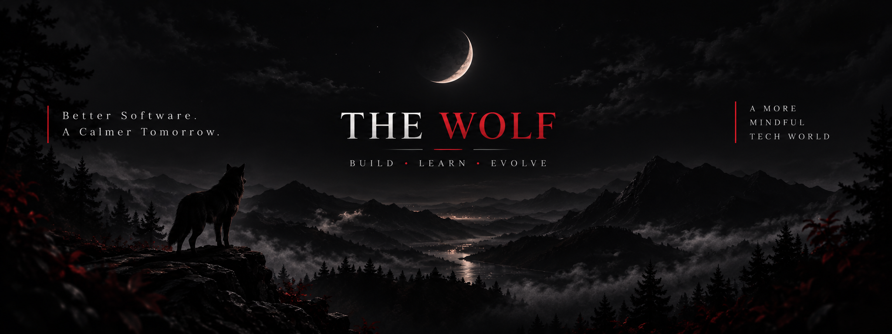

<!-- THE WOLF — Luan Verdelho -->

  

<h2>
  
  About Me
</h2>

  

---

<h2>
  
  Tech Stack
</h2>

---

<h2>
  
  GitHub Metrics
</h2>

  
  

  

---

<h2>
  
  Featured Projects
</h2>

&nbsp;&nbsp;
 
&nbsp;&nbsp;

  <strong>
    Engineering systems, exploring ideas and turning technical decisions into real products.
  </strong>

---

  

---

<h2>
  
  Find Me
</h2>

<h3 align="center">
  Want to talk software, architecture, AI or some weird idea?
</h3>

  <strong>
    I'm probably somewhere between building something, breaking something,
    and learning why it broke.
  </strong>

  
  &nbsp;
  

 

  

